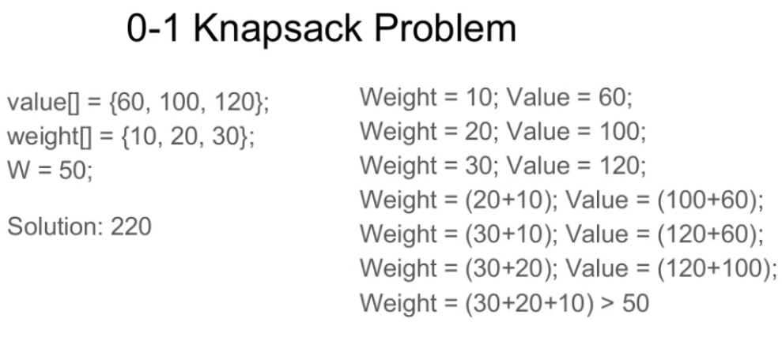

# Knapsack
Given weights and values of n items, put these items in a knapsack of capacity W to get the maximum total value in the 
knapsack. In other words, given two integer arrays val[0..n-1] and wt[0..n-1] which represent values and weights 
associated with n items respectively. Also given an integer W which represents knapsack capacity, find out the maximum
value subset of val[] such that sum of the weights of this subset is smaller than or equal to W. You cannot break an item, 
either pick the complete item or don’t pick it (0-1 property).

**Method 1**
    : Recursion by Brute-Force algorithm OR Exhaustive Search.

**Approach**
: A simple solution is to consider all subsets of items and calculate the total weight and value of all subsets.
Consider the only subsets whose total weight is smaller than W. From all such subsets, pick the maximum value subset.
Optimal Sub-structure: To consider all subsets of items, there can be two cases for every item.

**Case 1** 
: The item is included in the optimal subset.

**Case 2** 
: The item is not included in the optimal set.
Therefore, the maximum value that can be obtained from ‘n’ items is the max of the following two values.

Maximum value obtained by n-1 items and W weight (excluding nth item).
Value of nth item plus maximum value obtained by n-1 items and W minus the weight of the nth item (including nth item).
If the weight of 'nth' item is greater than 'W', then the nth item cannot be included and Case 1 is the only possibility.
